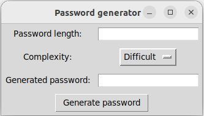

### Random-Password-Generator
Цей скрипт є програмою для генерації випадкового пароля за заданими параметрами. Він написаний на мові програмування [Python](https://www.python.org/downloads/) і використовує бібліотеку [Tkinter](https://docs.python.org/uk/3/library/tkinter.html) для створення графічного інтерфейсу користувача. За допомогою цього інтерфейсу користувач може ввести довжину пароля та вибрати його складність. Доступні три рівні складності: легкий, середній та складний
Залежно від складності пароля, програма використовує відповідний набір символів для його генерації. Наприклад, для легкого пароля використовується лише букви, а для складного - букви, цифри та спеціальні символи.
Після введення параметрів користувач може натиснути кнопку __"Generate password"__, щоб згенерувати випадковий пароль. Пароль відображається на екрані і може бути скопійований користувачем для використання в потрібних цілях. 
Скрипт може бути корисним для користувачів, які шукають надійний та безпечний спосіб створення випадкових паролів для своїх облікових записів в Інтернеті. Він є простим у використанні та має інтуїтивно зрозумілий інтерфейс, що дозволяє швидко та ефективно створювати паролі різної складності.
### ___Вимоги___
* [Python 3.x](https://www.python.org/downloads/)
* Бібліотека [tkinter](https://docs.python.org/uk/3/library/tkinter.html)

## ___Інструкція з використання___

* Введіть довжину пароля у поле __"Password length"__
* Виберіть рівень складності пароля: __Easy, Medium or Difficult__.
* Натисніть кнопку __"Generated password"__.
* Згенерований пароль з'явиться в полі __"Generated password"__.

## Інструкція з установки

1. Склонуйте репозиторій:
> git clone https://github.com/your_username/password-generator.git
2. Перейдіть до папки проекту:
> cd password-generator
3. Запустіть програму:
> python password_generator.py

## Ліцензія

Цей проект доступний під ліцензією MIT. Детальнішу інформацію можна знайти в файлі __LICENSE__.